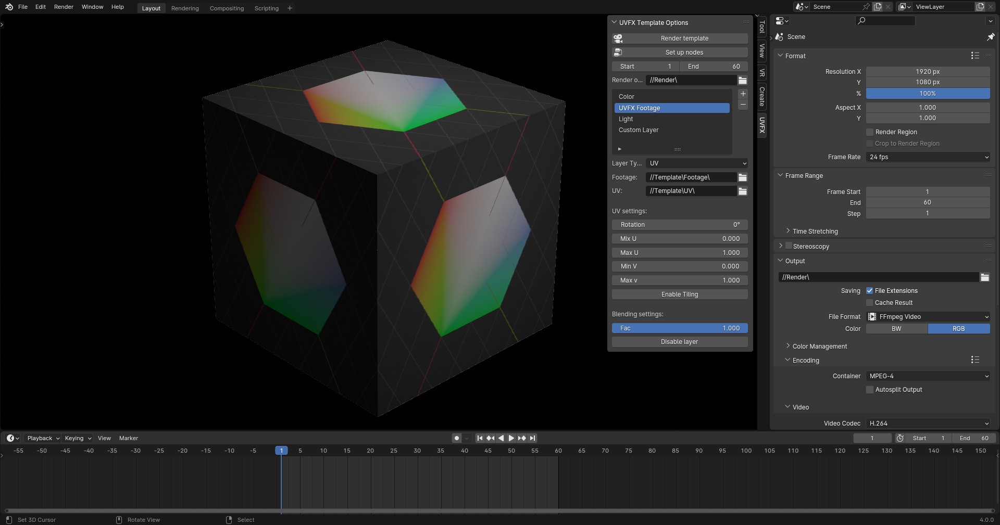

## UV_FX

UV_FX is a portable tool that can be used to turn your 3D graphics into reusable templates that can easily be used by everyone. UV_FX is great for things like:

- Custom video overlays with modifiable text
- Custom video transitions
- Turning any image into a waving 3D flag
- Meme templates ;)

## How it works

Templates make use of UV mapping in order to apply new footage to 3D renders after they've been rendered. Instead of rendering a normal image, you make a color, light and UV render. These renders can then be combined with custom footage without having to re-render your animation. 

You can do all of this manually, but UV_FX makes the process of sharing and creating templates a lot more straight-forward and organized. UV_FX automatically configures compositing for you and allows others to use templates without any technical Blender knowledge by offering a portable Blender file with custom UI.

## Usage Guide

### For template users

1. Place your footage in Template/Footage/
2. Open the UVFX template and allow automatic script execution
3. Change the transforms of your footage if necessary
4. Select a render output folder, Blender will render to //Render/ by default
5. Set the file format, the default is an MP4 file
6. Press 'Render template' (Normal renders won't work!)

If you add/remove layers or change layer types, you'll need to press 'Set up nodes' to see the result.

You can also animate layer properties if you want to.

### For template creators

**Rendering your animation**

If you use a complex compositing setup with color grading you'll need to set up these passes yourself.

**Rendering UVs**

There are a few important things to get right when rendering UVs. The first thing is the color space. Normal images are rendered using sRGB, but we want to use linear color mapping for better precision.

Due to the nature of UVs being used as coordinates instead of colors, there should also be no anti-aliasing between two pixels coordinates.

However, disabling anti-aliasing leads to problems too. It will make your footage look extremally jagged and grainy.

Fortunately, you can work around this problem by using a custom material. By applying blur in your material and disabling filtering, you're able to prevent aliasing around edges whilst keeping aliasing everywhere else.

**Layer setup**

Generally, your layers should be ordered in the following way:
1. Base color layer
2. UV overlay
3. Light layer
4. Additive light layer

**Custom layers**

Because UVFX automatically configures the node tree, you will need to use node groups to do your own compositing. The workflow is pretty simple:

1. Add a Custom or Custom+Footage layer
2. Click 'Set up nodes' to update the node tree
3. Go to the compositing tab
4. Find the 'Custom' or 'CustomFootage' node
5. Select the node and press 'Tab' to enter the node group tree
6. Add your own nodes to modify the footage
7. Success!

**Sharing your template**

If everything renders correctly, you can share your template with others. Just zip [UVFX.blend](UVFX.blend) and the 'Template' folder, then you can share it with whoever you want.

One thing to double-check is that all your paths are relative (They should begin with '//'), or they'll need to remapped afterwards.

## Usage Tips

- If you want sharp transitions between UVs, you will need to render UVs with 16-bit precision and no anti-aliasing (Set filter width to 0.01px in render of UV pass) and downscale. Replicate the rendering setup in [Example.blend](Example.blend) to get the best possible results.

## Contributing

If you want to contribute to UV_FX, please only edit [UVFX.py](UVFX.py) if you can. This is to avoid malicious code being embedded in the blend file. I will take care of embedding the changes in the blend file.